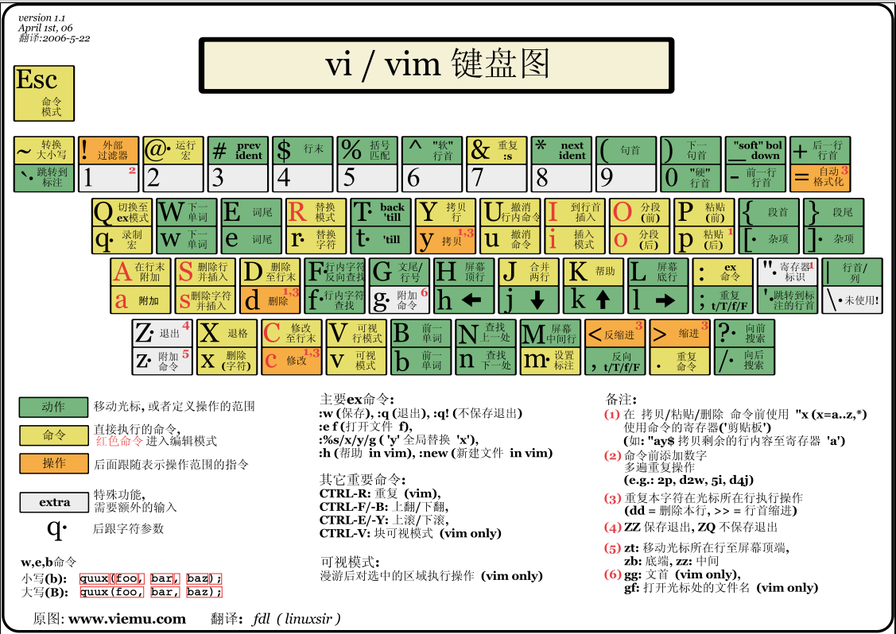
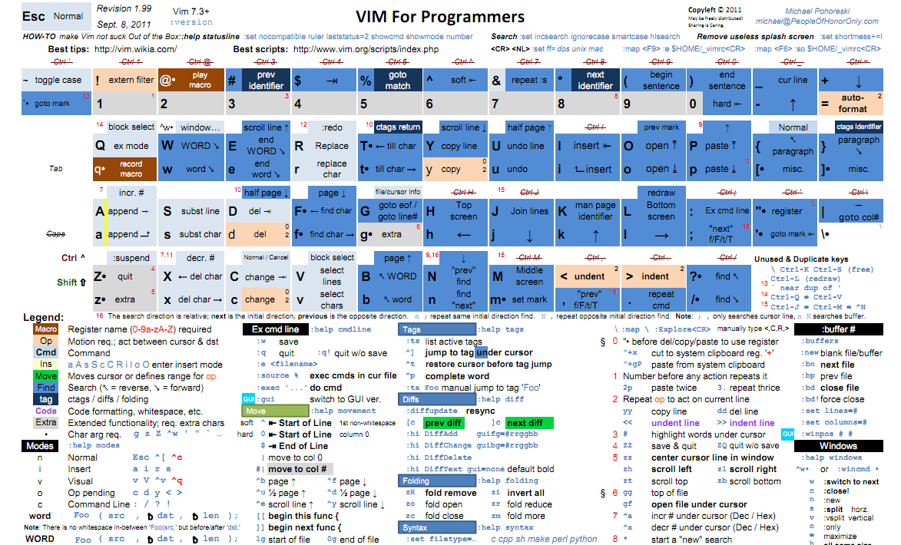

基于[wklken-vim](https://github.com/wklken/k-vim)
=================

# 安装步骤

clone到本地,配置到linux个人目录

        git clone https://github.com/xianyo/k-vim.git ~/.vim
        cd ~/.vim
        ./install.sh setup

# 快捷键

#### 修改的快捷键和插件快捷键

    1. 可以自己修改vimrc中配置，决定是否开启鼠标

    set mouse-=a           " 鼠标暂不启用, 键盘党....
    set mouse=a            " 开启鼠标

    2. 可以自己修改vimrc决定是否使用方向键进行上下左右移动，默认打开，可以注解
    hjkl  上下左右

    map <Left> <Nop>
    map <Right> <Nop>
    map <Up> <Nop>
    map <Down> <Nop>

    3. 上排F功能键

    F1 废弃这个键,防止调出系统帮助
    F2 set nu/nonu,行号开关，用于鼠标复制代码用
    F3 打开file tree
    F4 Tagbar 
    F5 set paste/nopaste,粘贴模式paste_mode开关,用于有格式的代码粘贴
    F6 代码格式优化化
    F7 编译运行
    F8 C,C++的调试
    F9 代码浏览
    F10 
    F11 分割窗口最大化
    F12 vimshell

    4. 分屏移动

    ctrl + jkhl 进行上下左右窗口跳转,不需要ctrl+w+jkhl

    5. 搜索
    ,/      去除匹配高亮

    6. buffer/tab相关
    <- / -> 前后buffer

    , + tn  新tab
    , + to  tabonly
    , + tc  close
    , + tm  tab move
    , + te  new tab edit

    7. 按键修改
    , + sa    select all,全选
    , + v     选中段落
    kj        代替<Esc>，不用到角落去按esc了
    t         新起一行，下面，不进入插入模式
    T         新起一行，上面
    , + q     :q，退出vim

    优化:
    1. j/k 对于换行展示移动更友好
    2. ; 修改成 : ，一键进入命令行模式，不需要按shift
    3. 命令行模式 ctrl+a/e 到开始结尾
    4. <和> 代码缩进后自动再次选中

#### 常用的快捷键

    ##### 光标控制命令 

    命令                        光标移动
    h或^h                    向左移一个字符
    j或^j或^n                向下移一行
    k或^p                    向上移一行
    l或空格                     向右移一个字符
    G                        移到文件的最后一行
    nG                       移到文件的第n行
    w                        移到下一个字的开头
    W                        移到下一个字的开头，忽略标点符号
    b                        移到前一个字的开头
    B                        移到前一个字的开头，忽略标点符号
    L                        移到屏幕的最后一行
    M                        移到屏幕的中间一行
    H                        移到屏幕的第一行
    e                        移到下一个字的结尾
    E                        移到下一个字的结尾，忽略标点符号
    (                        移到句子的开头
    )                        移到句子的结尾
    {                        移到段落的开头
    }                        移到下一个段落的开头
    0或|                     移到当前行的第一列
    n|                       移到当前行的第n列
    ^                        移到当前行的第一个非空字符
    $                        移到当前行的最后一个字符
    +或return                移到下一行的第一个字符
    -                        移到前一行的第一个非空字符

    ##### 在vi中添加文本

    命令                         插入动作
    a                        在光标后插入文本
    A                        在当前行插入文本
    i                        在光标前插入文本
    I                        在当前行前插入文本
    o                        在当前行的下边插入新行
    O                        在当前行的上边插入新行
    :r file                  读入文件file内容，并插在当前行后
    :nr file                 读入文件file内容，并插在第n行后
    escape                   回到命令模式
    ^v char                  插入时忽略char的指定意义，这是为了插入特殊字符

    ##### 在vi中删除文本

    命令                         删除操作
    x                        删除光标处的字符，可以在x前加上需要删除的字符数目
    nx                       从当前光标处往后删除n个字符
    X                        删除光标前的字符，可以在X前加上需要删除的字符数目
    nX                       从当前光标处往前删除n个字符
    dw                       删至下一个字的开头
    ndw                      从当前光标处往后删除n个字
    dG                       删除行，直到文件结束
    dd                       删除整行
    ndd                      从当前行开始往后删除
    db                       删除光标前面的字
    ndb                      从当前行开始往前删除n字
    :n,md                    从第m行开始往前删除n行
    d或d$                    从光标处删除到行尾
    dcursor_command          删除至光标命令处，如dG将从当产胆行删除至文件的末尾
    ^h或backspace            插入时，删除前面的字符
    ^w                       插入时，删除前面的字

    ##### 修改vi文本

    每个命令前面的数字表示该命令重复的次数
    命令                         替换操作
    rchar                    用char替换当前字符
    R text escape            用text替换当前字符直到换下Esc键
    stext escape             用text代替当前字符
    S或cctext escape         用text代替整行
    cwtext escape            将当前字改为text
    Ctext escape             将当前行余下的改为text
    cG escape                修改至文件的末尾
    ccursor_cmd text escape  从当前位置处到光标命令位置处都改为text

    ##### 在vi中查找与替换

    命令                         查找与替换操作
    /text                    在文件中向前查找text
    ?text                    在文件中向后查找text
    n                        在同一方向重复查找
    N                        在相反方向重复查找
    ftext                    在当前行向前查找text
    Ftext                    在当前行向后查找text
    ttext                    在当前行向前查找text，并将光标定位在text的第一个字符
    Ttext                    在当前行向后查找text，并将光标定位在text的第一个字符
    :set ic                  查找时忽略大小写
    :set noic                查找时对大小写敏感
    :s/oldtext/newtext       用newtext替换oldtext
    :m,ns/oldtext/newtext    在m行通过n，用newtext替换oldtext
    &                        重复最后的:s命令
    :g/text1/s/text2/text3   查找包含text1的行，用text3替换text2
    :g/text/command          在所有包含text的行运行command所表示的命令
    :v/text/command          在所有不包含text的行运行command所表示的命令

    ##### 在vi中复制文本

    命令                         复制操作
    yy                       将当前行的内容放入临时缓冲区
    nyy                      将n行的内容放入临时缓冲区
    p                        将临时缓冲区中的文本放入光标后
    P                        将临时缓冲区中的文本放入光标前
    dsfsd "(a-z)nyy          复制n行放入名字为圆括号内的可命名缓冲区，省略n表示当前行
    "(a-z)ndd                删除n行放入名字为圆括号内的可命名缓冲区，省略n表示当前行
    "(a-z)p                  将名字为圆括号的可命名缓冲区的内容放入当前行后
    "(a-z)P                  将名字为圆括号的可命名缓冲区的内容放入当前行前

    ##### 在vi中撤消与重复

    命令                         撤消操作
    u                        撤消最后一次修改
    U                        撤消当前行的所有修改
    .                        重复最后一次修改
    ,                        以相反的方向重复前面的f、F、t或T查找命令
    ;                        重复前面的f、F、t或T查找命令
    "np                      取回最后第n次的删除(缓冲区中存有一定次数的删除内容，一般为9)
    n                        重复前面的/或?查找命令
    N                        以相反方向重复前面的/或?命令

    ##### 保存文本和退出vi

    命令                         保存和/或退出操作
    :w                       保存文件但不退出vi
    :w file                  将修改保存在file中但不退出vi
    :wq或ZZ或:x              保存文件并退出vi
    :q!                      不保存文件，退出vi
    :e!                      放弃所有修改，从上次保存文件开始再编辑

    ##### vi中的选项

    选项                         作用
    :set all                 打印所有选项
    :set nooption            关闭option选项
    :set nu                  每行前打印行号
    :set showmode            显示是输入模式还是替换模式
    :set noic                查找时忽略大小写
    :set list                显示制表符(^I)和行尾符号
    :set ts=8                为文本输入设置tab stops
    :set window=n            设置文本窗口显示n行

    ##### vi的状态

    选项                         作用
    :.=                      打印当前行的行号
    :=                       打印文件中的行数
    ^g                       显示文件名、当前的行号、文件的总行数和文件位置的百分比
    :l                       使用字母"l"来显示许多的特殊字符，如制表符和换行符

    ##### 在文本中定位段落和放置标记

    选项                         作用
    {                        在第一列插入{来定义一个段落
    [[                       回到段落的开头处
    ]]                       向前移到下一个段落的开头处
    m(a-z)                   用一个字母来标记当前位置，如用mz表示标记z
    '(a-z)                   将光标移动到指定的标记，如用'z表示移动到z

    ##### 在vi中连接行

    选项                         作用
    J                        将下一行连接到当前行的末尾
    nJ                       连接后面n行

    ##### 光标放置与屏幕调整

    选项                         作用
    H                        将光标移动到屏幕的顶行
    nH                       将光标移动到屏幕顶行下的第n行
    M                        将光标移动到屏幕的中间
    L                        将光标移动到屏幕的底行
    nL                       将光标移动到屏幕底行上的第n行
    ^e(ctrl+e)               将屏幕上滚一行
    ^y                       将屏幕下滚一行
    ^u                       将屏幕上滚半页
    ^d                       将屏幕下滚半页
    ^b                       将屏幕上滚一页
    ^f                       将屏幕下滚一页
    ^l                       重绘屏幕
    z-return                 将当前行置为屏幕的顶行
    nz-return                将当前行下的第n行置为屏幕的顶行
    z.                       将当前行置为屏幕的中央
    nz.                      将当前行上的第n行置为屏幕的中央
    z-                       将当前行置为屏幕的底行
    nz-                      将当前行上的第n行置为屏幕的底行

    ##### vi中的shell转义命令

    选项                         作用
    :!command                执行shell的command命令，如:!ls
    :!!                      执行前一个shell命令
    :r!command               读取command命令的输入并插入，如:r!ls会先执行ls，然后读入内容
    :w!command               将当前已编辑文件作为command命令的标准输入并执行command命令，如:w!grep all
    :cd directory            将当前工作目录更改为directory所表示的目录
    :sh                      将启动一个子shell，使用^d(ctrl+d)返回vi
    :so file                 在shell程序file中读入和执行命令

    ##### 在vi中缩进文本

    选项                         作用
    ^i(ctrl+i)或tab          插入文本时，插入移动的宽度，移动宽度是事先定义好的
    :set ai                  打开自动缩进
    :set sw=n                将移动宽度设置为n个字符
    n<<                      使n行都向左移动一个宽度
    n>>                      使n行都向右移动一个宽度，例如3>>就将接下来的三行每行都向右移动一个移动宽度

# 插件

1. ####插件管理 [gmarik/vundle](https://github.com/gmarik/vundle)

    必装,用于管理所有插件
    命令行模式下管理命令:

        :BundleInstall     install
        :BundleInstall!    update
        :BundleClean       remove plugin not in list

2. ####代码自动补全 [Valloric/YouCompleteMe](https://github.com/Valloric/YouCompleteMe)

    必装，强烈推荐(YCM是我目前用到的最好的自动补全插件)

    需要编译这个插件(见github文档)

    这个需要自己去看官方的配置方式,演示在官方github有

    需要Vim 7.3.584 以上版本([如何编译vim](https://github.com/Valloric/YouCompleteMe/wiki/Building-Vim-from-source))

    这个插件包含了以下几个插件功能,所以不需要装下面:

        clang_complete
        AutoComplPop
        Supertab
        neocomplcache
        jedi(对python的补全)

    快捷键:

        ,gd  跳到声明位置, 仅 filetypes: c, cpp, objc, objcpp, python 有效

3. ####代码片段快速插入 [SirVer/ultisnips](https://github.com/SirVer/ultisnips) +[honza/vim-snippets](https://github.com/honza/vim-snippets)

    必装，效率杀手锏，快速插入自定义的代码片段

    代码片段集合，有缺陷

    自动补全加这个,高效必备, 针对各种语言已经带了一份配置了，可以到安装目录下查看具体，我有针对性补全一份，在my_snippets目录下，可自行修改

    演示

    

4. ####Tagbar [majutsushi/tagbar](https://github.com/majutsushi/tagbar)

         [sd] <F4> 打开

    演示

    

5. ####Markdown [plasticboy/vim-markdown](https://github.com/plasticboy/vim-markdown)

    markdown语法,编辑md文件

    
6. ####状态栏增强 [bling/vim-airline](https://github.com/bling/vim-airline)

    演示

    

7. ####vim-bufferline [bling/vim-bufferline](https://github.com/bling/vim-bufferline)

    状态栏显示buffer

    演示
    
    in the statusline

    

    or the command bar

    

8. ####vimcdoc [asins/vimcdoc](https://github.com/asins/vimcdoc)

    vim中文帮助文档
    
9. ####多语言语法检查 [scrooloose/syntastic](https://github.com/scrooloose/syntastic)

    建议安装，静态语法及风格检查,支持多种语言

    修改了下标记一列的背景色,原有的背景色在solarized下太难看了…..

    演示

    

    
10. ####搜索 [kien/ctrlp.vim](https://github.com/kien/ctrlp.vim)

    文件搜索,ack/Command-T需要依赖于外部包,不喜欢有太多依赖的,除非十分强大, 具体 [文档](http://kien.github.io/ctrlp.vim/)

        [sd] ,p  打开ctrlp搜索
        [sd] ,f  相当于mru功能，show recently opened files

        ctrl + j/k 进行上下移动
        ctrl + x/v 分屏打开该文件
        ctrl + t   在新tab中打开该文件

    演示

    

    插件:
    当前文件快速函数搜索:[tacahiroy/ctrlp-funky](https://github.com/tacahiroy/ctrlp-funky)

    解决问题:使用tagbar当函数比较多的时候,移动耗时较长,使用快速搜索快很多

        ,fu   进入当前文件函数搜索
        ,fU   搜索光标下单词对应函数

11. ####目录树 [scrooloose/nerdtree](https://github.com/scrooloose/nerdtree)

    必装,开启目录树导航

        [sd]
            ,n  打开 关闭树形目录结构 或者F3

            在nerdtree窗口常用操作：(小写当前，大写root)
            x.......收起当前目录树
            X.......递归收起当前目录树
            r.......刷新当前目录
            R.......刷新根目录树

            p.......跳到当前节点的父节点
            P.......跳到root节点
            k/j.....上下移动
            K.......到同目录第一个节点
            J.......最后一个节点

            o.......Open files, directories and bookmarks
            i.......split上下分屏
            s.......vsplit左右分屏
            c.......将当前目录设为根节点
            q.......关闭

    演示

    
    
12. ####快速注释 [scrooloose/nerdcommenter](https://github.com/scrooloose/nerdcommenter)

    必装，另一个大大提升效率的地方，快速批量加减注释

        [d] shift+v+方向键选中(默认当前行)
            ->  ,cc  加上注释
            -> ,cu 解开注释

    演示

    

    附:注释还有其他两种插件可选[tcomment](https://github.com/tomtom/tcomment_vim) 和[tpope/vim-commentary](https://github.com/tpope/vim-commentary)

13. ####区块伸缩 [terryma/vim-expand-region](https://github.com/terryma/vim-expand-region)

    视图模式下可伸缩选中部分，用于快速选中某些块

        [sd]
        + 增加选中范围(+/=按键)
        _ 减少选中范围(_/-按键)

    演示（直接取链到其github图)

    

14. ####多光标选中编辑 [terryma/vim-multiple-cursors](https://github.com/terryma/vim-multiple-cursors)

    多光标批量操作

        [sd]
        ctrl + m 开始选择
        ctrl + p 向上取消
        ctrl + x 跳过
        esc   退出

    演示(官方演示图)

    
15. ####git 常用操作 [tpope/vim-fugitive](https://github.com/tpope/vim-fugitive)

    git插件, 编辑文件时进行一些diff操作,例如diff

    不是很习惯,所以用的次数太少,目前和现有配置快捷键有冲突,尚未解决

        [sd]
        ,ge   = git diff edit[gd被ycm占用了]

    没有配置其他快捷键,可以参照github,自己增加修改映射

16. ####git状态 [airblade/vim-gitgutter](https://github.com/airblade/vim-gitgutter)

    git,在同一个文件内,通过标记和高亮,显示本次文件变更点

        [sd]
        ,gs   = show diff status [gd被ycm占用了]

    
    
17. ####位置跳转[Lokaltog/vim-easymotion](https://github.com/Lokaltog/vim-easymotion)

    必装，效率提升杀手锏，跳转到光标后任意位置

    配置(我的leader键配置 let g:mapleader = ',')

        ,, + w  跳转
        ,, + fe  查找'e',快速跳转定位到某个字符位置

    演示

    

    
28. ####快速编辑 [tpope/vim-surround](https://github.com/tpope/vim-surround) +[tpope/vim-repeat](https://github.com/tpope/vim-repeat)

    必装，很给力的功能，快速给词加环绕符号,例如引号

    repeat进行增强,'.'可以重复命令

        [d]
        cs"' [inside]
        "Hello world!" -> 'Hello world!'
        ds"
        "Hello world!" -> Hello world!
        ysiw"
        Hello -> "Hello"

    演示

    

29. ####赋值语句代码对齐 [godlygeek/tabular](https://github.com/godlygeek/tabular)

    将代码,或者json等,进行对齐,具体见 [tabular-vim](http://vimcasts.org/episodes/aligning-text-with-tabular-vim/)

        [sd]  可以选中多行,不选中默认操作当前行
            ,a= 对齐等号表达式
            ,a: 对齐冒号表达式(json/map等)

20. ####mark跳转 [kshenoy/vim-signature](https://github.com/kshenoy/vim-signature)

21. ####文件时光机 [sjl/gundo.vim](https://github.com/sjl/gundo.vim)

    编辑文件时光机

        [sd] ,h  查看文件编辑历史

    附:同类插件 [mbbill/undotree](https://github.com/mbbill/undotree)

22. ####括号上色高亮 [kien/rainbow_parentheses.vim](https://github.com/kien/rainbow_parentheses.vim)

    演示

    

23. ####solarized主题[altercation/vim-colors-solarized](https://github.com/altercation/vim-colors-solarized)

   经典主题
   

24. ####molokai主题[tomasr/molokai](https://github.com/tomasr/molokai)

   用sublime text2的同学应该很熟悉, 另一个主题,可选,偶尔换换味道
       

25. ####Buffer [fholgado/minibufexpl.vim](https://github.com/fholgado/minibufexpl.vim)

    buffer管理
    
    注释掉了。用vim-bufferline

        [sd]
            <Tab>  切换buffer
            左右方向键  切换buffer
            ,bn   切到后一个
            ,bp   切到前一个
            ,bd   关闭当前buffer

26. ####YankRing [YankRing.vim](http://www.vim.org/scripts/script.php?script_id=1234)

27. ####SrcExpl [wesleyche/SrcExpl](https://github.com/wesleyche/SrcExpl)

28. ####ZoomWin [ZoomWin](http://www.vim.org/scripts/script.php?script_id=508)

29. ####std_c [std_c.zip](http://www.vim.org/scripts/script.php?script_id=234)

30. ####vimshell [Shougo/vimshell.vim](https://github.com/Shougo/vimshell.vim)

31. ####vimim [vimim/vimim](https://github.com/vimim/vimim)

# VIM TIPS

